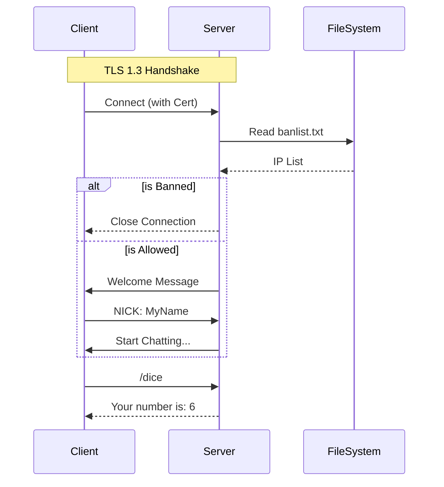

```mermaid
sequenceDiagram
    participant Client
    participant Server
    participant FileSystem

    Note over Client,Server: TLS 1.3 Handshake
    Client->>Server: Connect (with Cert)
    Server->>FileSystem: Read banlist.txt
    FileSystem-->>Server: IP List
    alt is Banned
        Server-->>Client: Close Connection
    else is Allowed
        Server->>Client: Welcome Message
        Client->>Server: NICK: MyName
        Server->>Client: Start Chatting...
    end
    
    Client->>Server: /dice
    Server-->>Client: Your number is: 6
```
